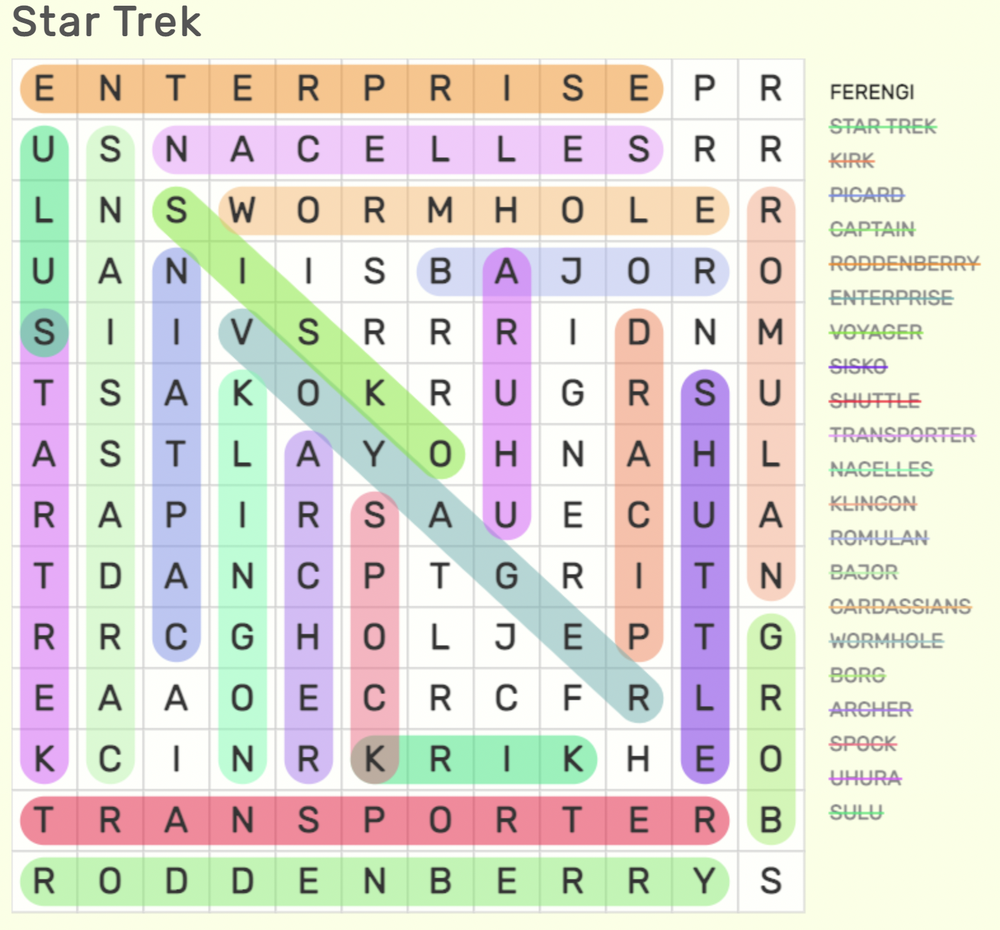
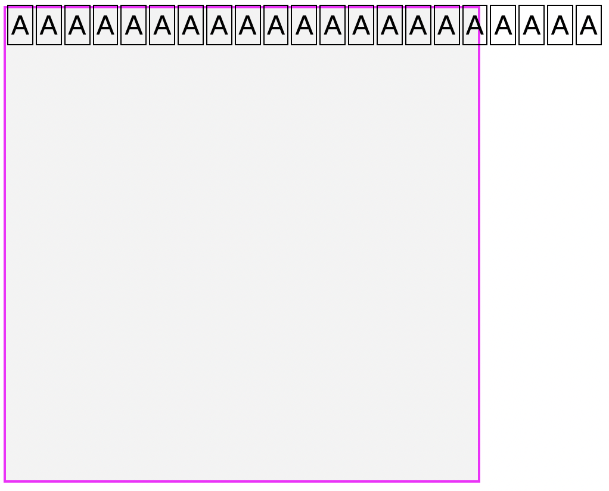
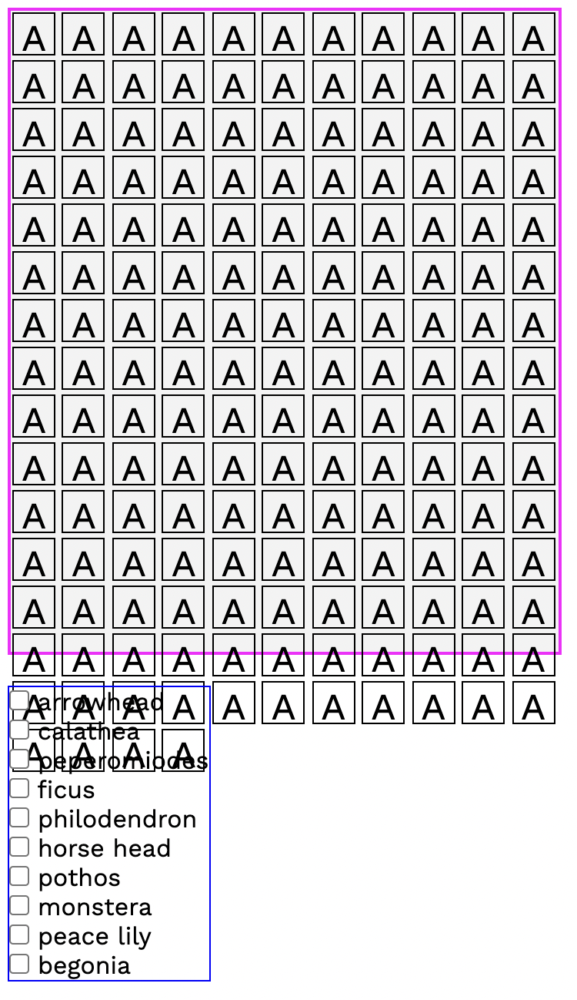
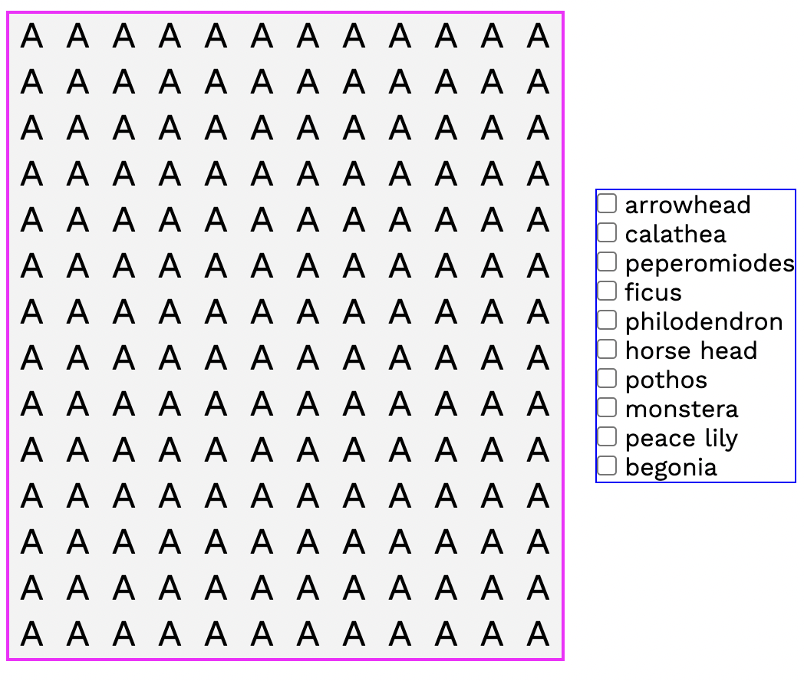
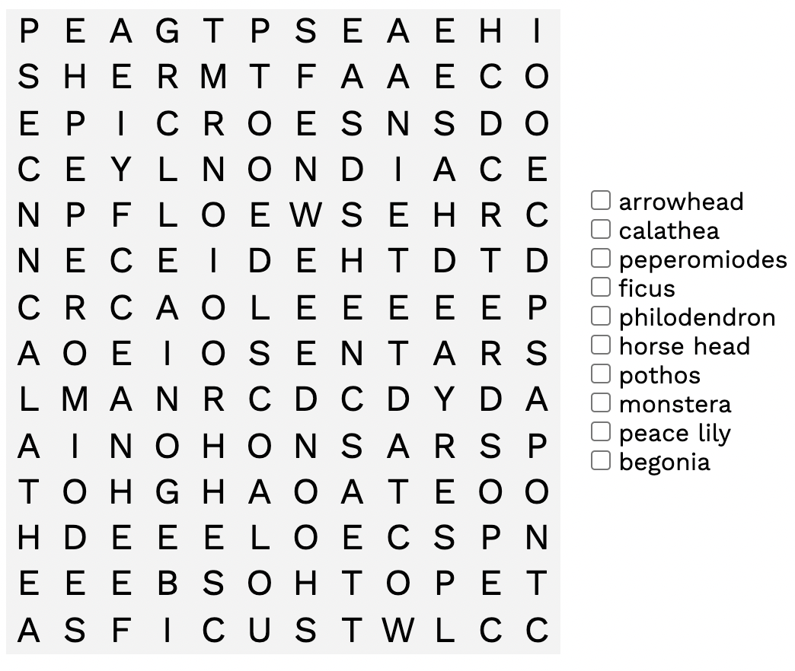
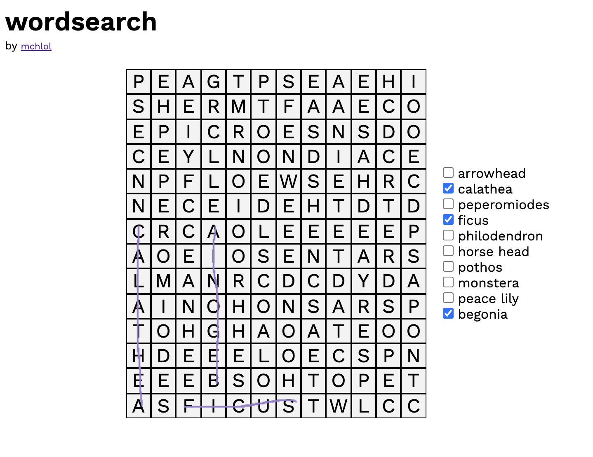
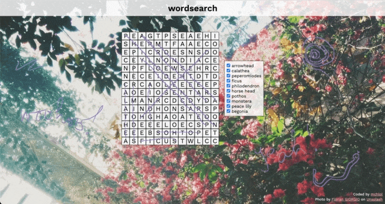

# Word Search

## Inspiration/Resources

[Word search by ED](https://ed.studio/made-post/algebraic-wordsearch)  
[Crossword by Adrian Roworth](https://codepen.io/adrianroworth/pen/OpeyZq) / [Sitepoint](https://www.sitepoint.com/how-built-pure-css-crossword-puzzle/)  
[The Word Search](https://thewordsearch.com/puzzle/46/star-trek/)  
[Code Guppy](https://codeguppy.com/site/tutorials/word-search.html)  
[Lovatt's Puzzles](https://lovattspuzzles.com/online-puzzles-competitions/play-daily-word-search-puzzle-online/)  
[My Word Search](https://mywordsearch.com/)  
[Maven Spun](https://mavenspun.com/javascript/word-search/01-create-a-wordsearch-game-board.htm)  
[Wordfind.js](https://github.com/bunkat/wordfind)
[Word Search 2 Codepen by Conor092](https://codepen.io/Conor092/pen/OZPMKd)

## Planning

Some thoughts on what I would like to do, prior to starting.
I'll be using HTML, CSS, & vanilla JavaScript/ES6.

### Essential

* Generate a grid of x by x cells
* populate the grid with words from the word list
* fill in the rest of the cells with random letters
* a list of words with checkboxes tells the user what to search for
* a canvas element goes over the top of the grid
* the user can draw over the grid to mark words they have found  

12 across, 14 down (generated at [The Word Search](https://thewordsearch.com/puzzle/46/star-trek/))
* the pen is transparent and a bright colour
* house plant-themed design

### Nice to have

* the user can submit once they find all the words and 'win a prize'
* the cursor is a pencil or similar or a littLE HAND!?
* pick from a selection of highlighter colours
* hovering over the word name shows a small picture attached to the cursor 
* hovering over the word name goes to a link about the word
* quick poll - do you search by row/column or scan at random?
* either store this data for results (complex) or respond to the users answer (easier)
* a secret extra word - submit for validation for super special prize
* good if the grid can randomise 
* cross off a word when it has been found
* a timer might be fun

### Quick notes

* I've done some of these elements before - generating a grid with the etchasketch and using the canvas with superdraw.
* Z-index for layering the canvas and grid
* [Get mouse position](https://stackoverflow.com/questions/17130395/real-mouse-position-in-canvas) 
* pop up modal for 'prizes'
* prizes are something ridiculous like a stick figure drawing, dad joke, or a random gif.

### Words

Plants:
1. arrowhead
2. calathea
3. peperomiodes
4. ficus
5. philodendron
6. horse head
7. pothos
8. monstera
9. peace lily
10. begonia

## Display

Create the grid.   
Go back to the pixel sketchpad project and take a look at the code to remember how I did it.  
I've considered just hard coding the actual wordsearch and save it as a kind of prototype, before coding the script to automatically generate it. Then I realised I would have to hand code 100 cells and decided that is not in the spirit of programming 😅  

So I need to write a function that will create cells in the form of a span tag with a letter inside.  
Each 'cell' should have a class of cell and an id of cell000 (number from 001 to 100).  
Create a cell, give it a common class, give it a unique ID (number from 1 to 100), append it to the grid.  
  

**Problem 1**  

Cell is only appending to the grid once. Even though this part of the code is inside the for loop which counts from 0 to 100.  
The problem was in the nested for loop that was supposed to be handing out unique IDs. I actually realised I didn't need this as I was already counting to *value* (100) so I used the counter variable in the for loop to provide the id. Deleting that part of the code fixed the problem 🎶but I don't know why 🎶.
  

**Problem 2**  

When the cells are now appending to the grid, they continue horizontally instead of wrapping. 

*Screaming*

The grid columns and rows are set to `repeat(10, 1fr)`.
I changed span to div (from an inline element to a block element) and the divs then fill the width of the container but stretch it out vertically. I want the created elements, whether they are spans or divs, to be bound by the size of their container.  
Changing `grid-auto-flow` to `column` (or `row dense`) has no effect. I haven't used grid much so tempted to switch to flexbox...but no! I must master this.
*Interestingly this problem did not happen at all with the pixel sketchpad even at this barebones stage so I feel like there is something very obvious that I'm missing...*   
   
Ok I found it. I had set `display: inline-block` on the grid container so that it and the words wrapper would sit side by side. HOWEVER we already have a `display` property which we set to `grid` first, so `inline-block` was overriding it - it was never actually a grid. Total derp moment. Anyway we can set the alignment by using flex on the container holding both sections.
  
  
**Problem 3**  

I've added 100 cells to my grid. But as the starting size is 400px x 400px, they don't quite fit. 

So we need to do some maths. If we have 12 across and 14 down:    
width = 11 x 30px  
height = 14 x 30px  
Cell size = 30px  
Board size = (12 x 30) * (14 x 30) = 360 x 420  
Number of cells = 12 x 14 = 168  

Looks good! Let's add the words. 
  

## Adding the words!  
  

Add the words to the board and fill in the rest of the cells with random letters.  
It should look something like this:  

*I realised this part was going to take something more complicated that I haven't worked with yet - matrices. So, I took a slightly shorter way and went through the DOM in devtools to add the letters, then copy & pasted that code into my html file. Not short exactly, but short enough to give me something to work with.*  

  

## The Canvas

I took the canvas code I worked with on [SuperDraw]() and tried to repurpose it to draw on the grid to find the words. It...did not work. Making the canvas the same size and position as the grid meant the mouse position was all wrong. [I'll come back to this later.](https://stackoverflow.com/questions/17130395/real-mouse-position-in-canvas)
Just to get something working, I left the canvas as 100% of the window `innerHeight` and `innerWidth` and adjusted the position so that the 'pen' would actually draw on the grid. I found this [answer on StackOverflow](https://stackoverflow.com/questions/25058135/overlay-canvas-on-a-div-with-css) - basically the canvas needs these these properties: `position: absolute`, `overflow: hidden` and `display: block`.  
The other issue is getting the pen to be transparent. While the pen uses rgba, continuous drawing overwrites the transparency. I suspect this will need to be done with `fillStyle` instead of `strokeStyle`.  
  
I also added a background image and a bit more styling, yada yada yada.  

**Problem4**

The canvas isn't getting wiped when the window resizes, but of course all the things move. Ideally the canvas should only be placed over the actual grid itself so that will probably fix this problem.
  

### Next up:

- Creating the function that will place the words in the grid and populate the rest of the cells with random letters
- Setting the canvas directly over the grid
- Fixing the transparent pen!

